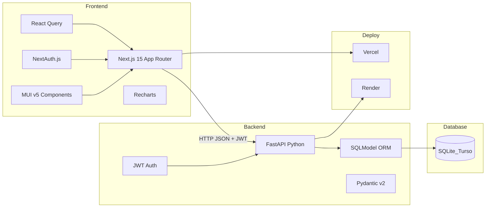
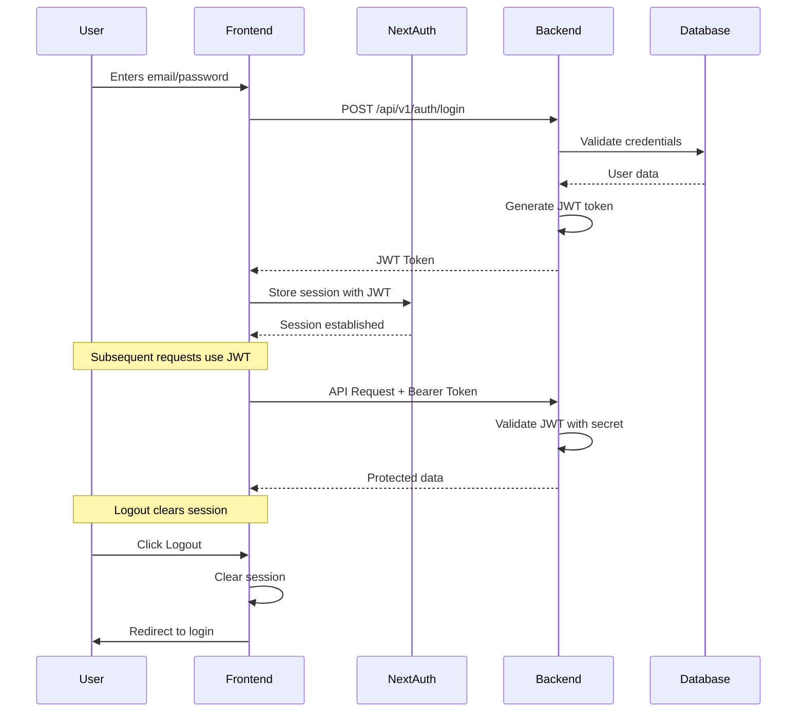
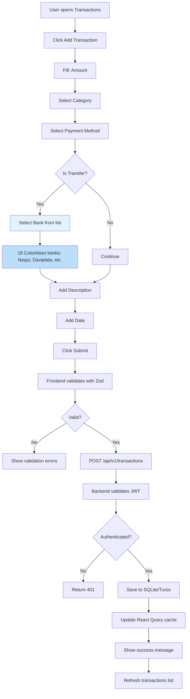
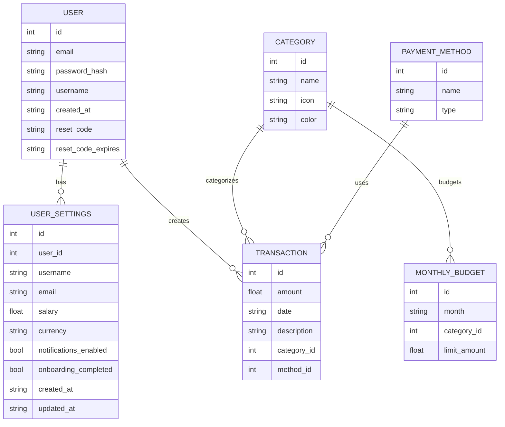
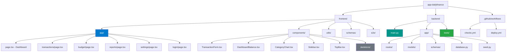
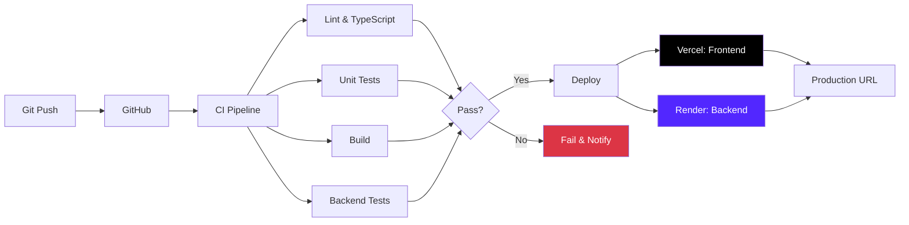
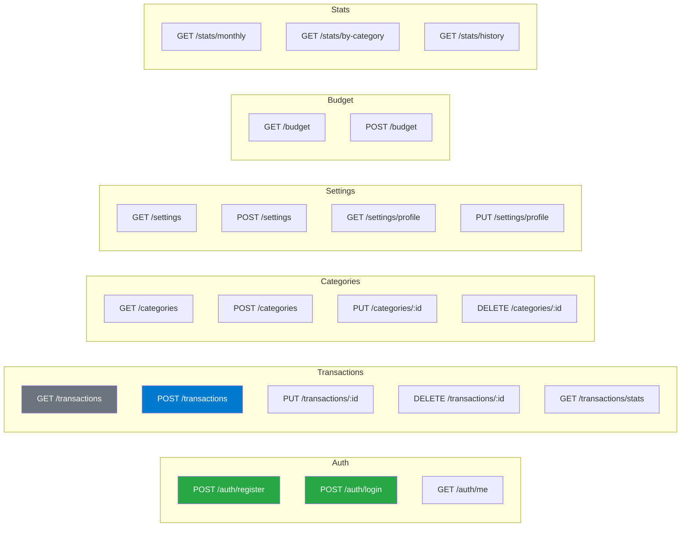

# 🏦 Daily Finance - Architecture Documentation

> Complete architecture overview of the Daily Finance application - a personal finance management system.

---

## 📊 Architecture Overview

---

## 🔐 Authentication Flow

---

## 💳 Transaction Flow

---

## 🛠️ Technology Stack

```mermaid
graph TD
    A[Daily Finance App] --> B[Frontend]
    A --> C[Backend]
    A --> D[Database]
    A --> E[Infrastructure]
    A --> F[Testing]
    A --> G[CI/CD]
    
    B --> B1[Next.js 15]
    B --> B2[React 18]
    B --> B3[TypeScript]
    B --> B4[MUI v5]
    B --> B5[React Query]
    B --> B6[Recharts]
    B --> B7[NextAuth.js]
    
    C --> C1[FastAPI]
    C --> C2[Python 3.13]
    C --> C3[SQLModel]
    C --> C4[Pydantic v2]
    C --> C5[JWT/Passlib]
    
    D --> D1[SQLite_Dev]
    D --> D2[Turso_libSQL_Prod]
    D --> D3[PostgreSQL_Optional]
    
    E --> E1[Vercel_Frontend]
    E --> E2[Render_Backend]
    
    F --> F1[Vitest]
    F --> F2[React Testing Library]
    F --> F3[Pytest]
    F --> F4[Playwright]
    
    G --> G1[GitHub Actions]
    G --> G2[Husky Pre-commit]
    G --> G3[ESLint]
    G --> G4[TypeScript]
    
    style B1 fill:#000000,color:#fff
    style C1 fill:#009688,color:#fff
    style D1 fill:#ff9800,color:#000
    style E1 fill:#000,color:#fff
    style F1 fill:#6c757d,color:#fff
```

---

## 🗄️ Database Schema

---

## 📁 Project Structure

---

## 🚀 Deployment Flow

---

## 🔗 API Endpoints Summary

---

## 📝 Key Implementation Details

### Authentication
- **JWT-based** using `python-jose` and `passlib`
- Tokens stored in HTTP-only cookies via NextAuth.js
- Token validation on every protected endpoint
- Optional auth endpoints return demo data

### State Management
- **Server State**: React Query (@tanstack/react-query)
- **Client State**: React hooks (useState, useEffect)
- **Auth State**: NextAuth.js session + JWT

### Form Validation
- **Frontend**: React Hook Form + Zod
- **Backend**: Pydantic v2 with strict validation

### Testing Strategy
- **Unit Tests**: Vitest (frontend), Pytest (backend)
- **E2E Tests**: Playwright
- **Coverage**: Minimum 80% on critical paths

### Performance Optimizations
- Next.js App Router with Server Components
- React Query caching and deduplication
- SQLite with proper indexing
- Debounced search inputs

---

## 🎯 Features Implemented

| Feature | Status | Description |
|---------|--------|-------------|
| User Authentication | ✅ | Register, Login, JWT |
| Dashboard | ✅ | Stats, charts, recent transactions |
| Transactions CRUD | ✅ | Create, Read, Update, Delete |
| Transferencias | ✅ | 18 Colombian banks integration |
| Budget | ✅ | Monthly budget per category |
| Reports | ✅ | Monthly and category statistics |
| Settings | ✅ | User profile, salary, currency |
| Skeleton Loaders | ✅ | Loading states for all pages |
| Unit Tests | ✅ | 40+ tests (Vitest + Pytest) |
| E2E Tests | ✅ | 11 Playwright tests |
| CI/CD | ✅ | GitHub Actions + Husky |

---

## 📚 Learning Resources Used

- [Next.js 15 Documentation](https://nextjs.org/docs)
- [FastAPI Documentation](https://fastapi.tiangolo.com/)
- [MUI v5 Documentation](https://mui.com/)
- [React Query Documentation](https://tanstack.com/query)
- [SQLModel Documentation](https://sqlmodel.tiangolo.com/)
- [Mermaid.js Diagrams](https://mermaid.js.org/)

---

## 🤝 Contributing

Feel free to submit PRs or open issues to improve this architecture documentation or the application itself.

---

## 📄 License

MIT License - See LICENSE file for details.

---

*This architecture documentation was created to demonstrate Fullstack implementation skills using modern technologies.*